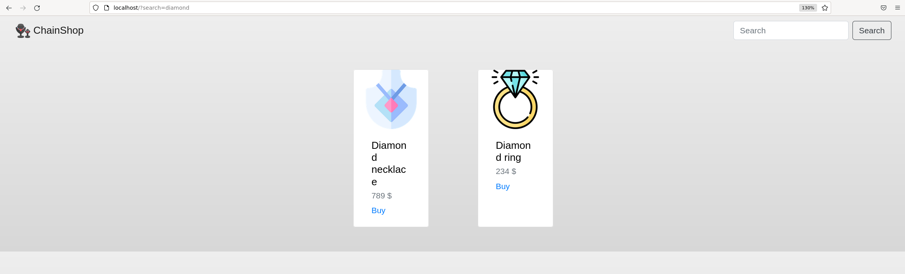
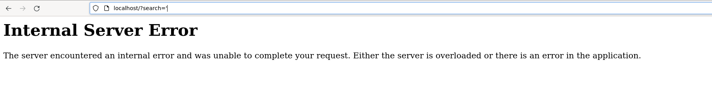
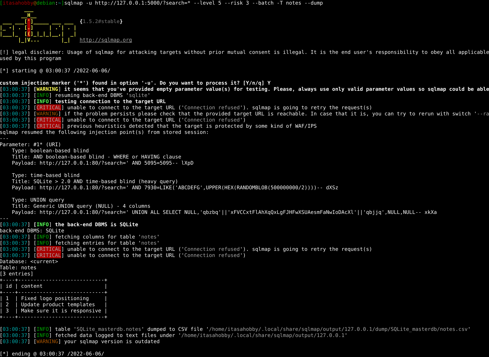
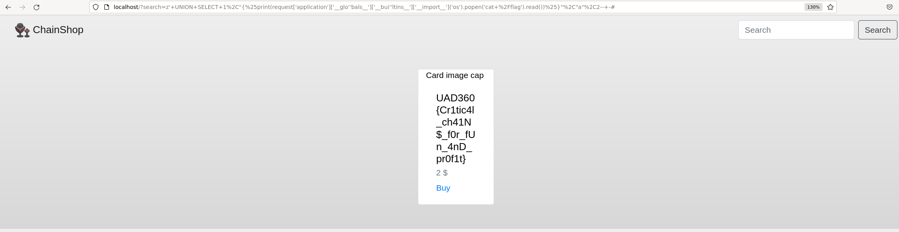

# Chain shop

## Summary

Flag: `UAD360{Cr1tic4l_ch41N$_f0r_fUn_4nD_pr0f1t}`

Description: Our jewelry store has just launched a public bug bounty, would you be able to report any vulnerability?

## Write-up

We are given a simple website with just a search input:



Trying different common payloads for injections we easily see that is vulnerable to SQL Injection.



Now we can dump the database with sqlmap:



There is some entries in the database with some notes, in one of them it makes some references to templates.

It seems vulnerable to STTI from within SQL injection results:

```
z' UNION SELECT 1,"","a",2-- -
```

However in order to get RCE here are some blacklisted characters:

* `{{` & `if` & `set`: As previously explained it can be bypassed with ``
* `\`: It does not allow us to use other type of encodings like hexa or octal
* `"`: This is an easy one, just change `"` with `'`
* `__class__` & `__globals__` & `__builtins__` & `+`: We can use string concatenation, keep in mind that in python we do not need `+` to do so.

> Originally the challenge was designed to not allow `if` & `set`. However forgot to add them to the blacklist so it could also get exfiltrated with conditionals.

The payload would look something like this:
```
z' UNION SELECT 1,"","a",2-- -
```

