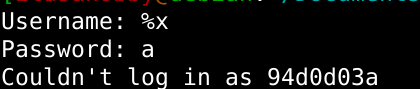
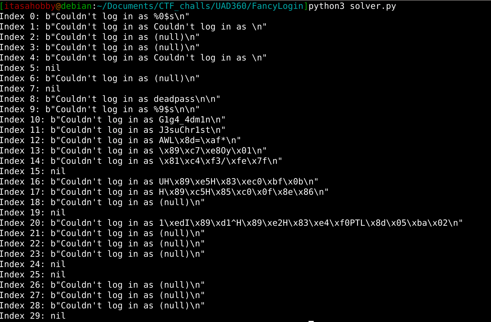

# Fancy login

## Write-up

For this challenge there is no source code, only a port listening with a login.

Testing out the input it is vulnerable to format strings:

Finally we write a solver to leak the credentials from the stack:
