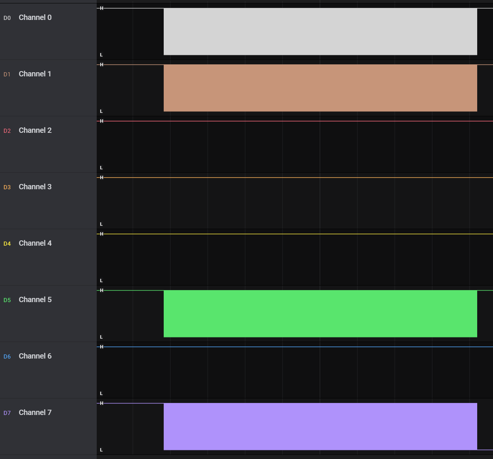
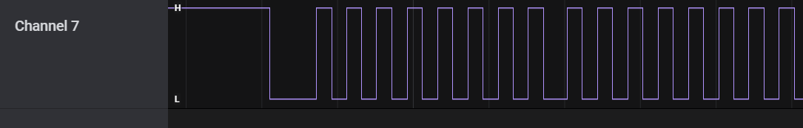
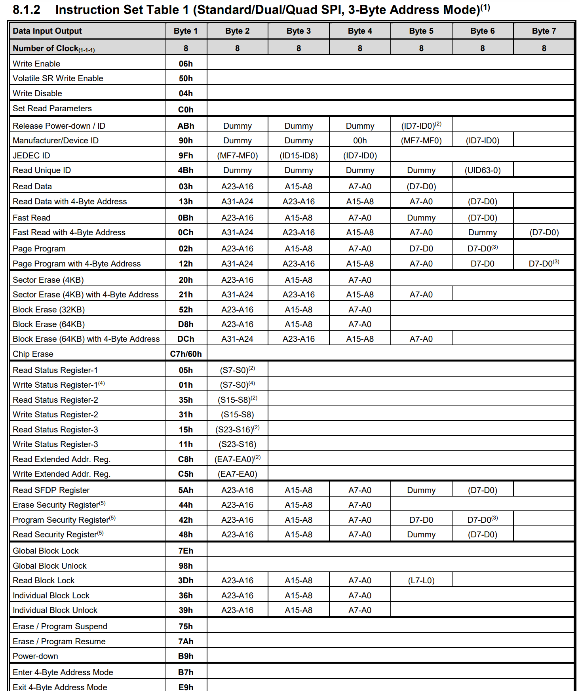
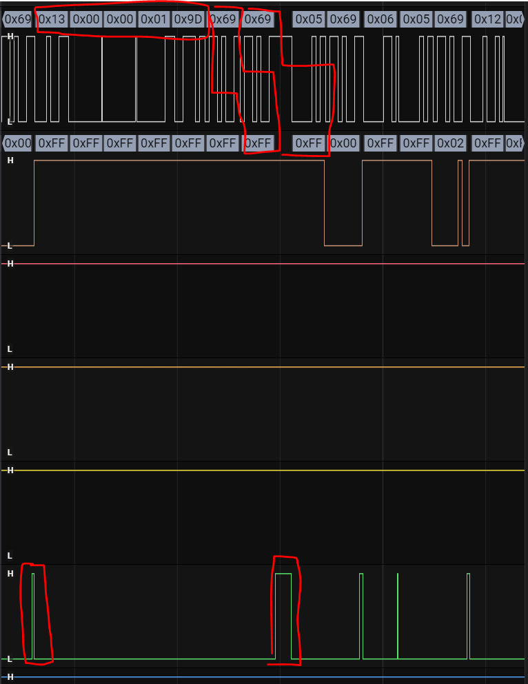
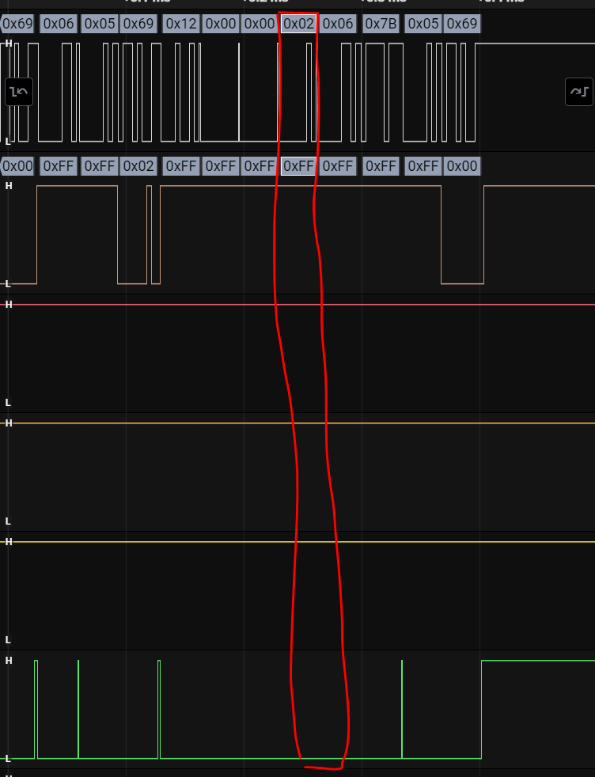
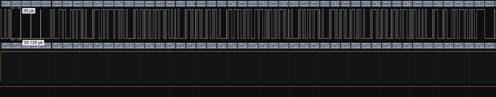
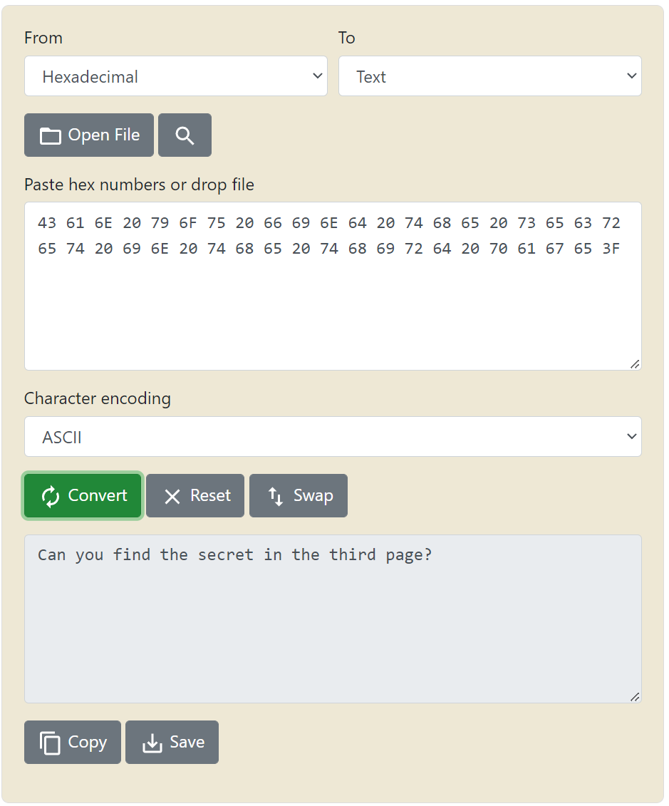
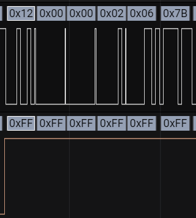

# Flashy secrets

## Summary

Flag: `UAD360{fe735c10ed582956662483e7c1839f0d}`

Description: Bob is trying to create a startup with an innovative product, for that he is using the newest flash on the market (W25Q512JV). Testing it out he wrote a secret message. He wonders if we are able to know what it is.

## Write-up

In the traffic capture, you can see that there are four channels:

Most likely that means it is using SPI protocol, it also fits with the flash model given in the description.

Next, we must identify which pin is each channel:
* Channel 7: There are repeated pulses so it must be the clock (CLK).

    

* Channel 5: There are hardly any pulses, so we can deduce that it is SS pin.

Therefore channels 0 and 1 are MISO and MOSI, we still don't know which one is each but it doesn't matter for the moment.

In the flash [datasheet](https://www.winbond.com/resource-files/W25Q512JV%20SPI%20RevG%2001122022Plus.pdf) all available instructions are listed:

Interesting instructions are the following:
* 03h: Read Data
* 13h: Read Data with 4-Byte Address
* 02h: Page Program
* 12h: Page Program with 4-Byte Address

Starting with reading ones, let's see if there are any, we start by inspecting the first match. CS is activated and then `0x12` is written in channel 0, so channel 0 is `DI` and channel 1 `DO` according to datasheet.

Now we know which channel is `DI` we can confirm that instruction `03h` is never used.

We continue searching instruction `13h`, we still don't see anything interesting, however we are going to analyze one of the cases:

Firstly the instruction is used to read using address `0x0000019D`, two bytes are read and both have the value of `0xFF`, so we can assume that it is not relevant information.

Continuing with next instruction `02h`, it is never used. It may seem like it was used but is just pure coincidence within address or sent after other instruction, this can be seen in the following image where  SS pin was not activated:

Finally let's see what we find with instruction `12h` instruction. If we observe the first time it is used it writes quite a lot of information at address `0x00000000`:

Converting the content to ASCII we get the following message:

Seems that we need to list the information stored in the third page, from the previous tests we know that it cannot be a read. So the last step is to obtain write instructions whose address is on that page.
A detail to take into account is that sectors are 256 bytes as stated in the datasheet.

For that reason we look for addresses between `0x200` and `0x300`.

In the second write instruction we see how the value for the address `0x206` is `0x7B` which coincides with `{`, knowing that the flag format is `UAD360{` we can confirm that we are on the right track because the seventh character is just that:

This way, the only thing left is to build the flag.