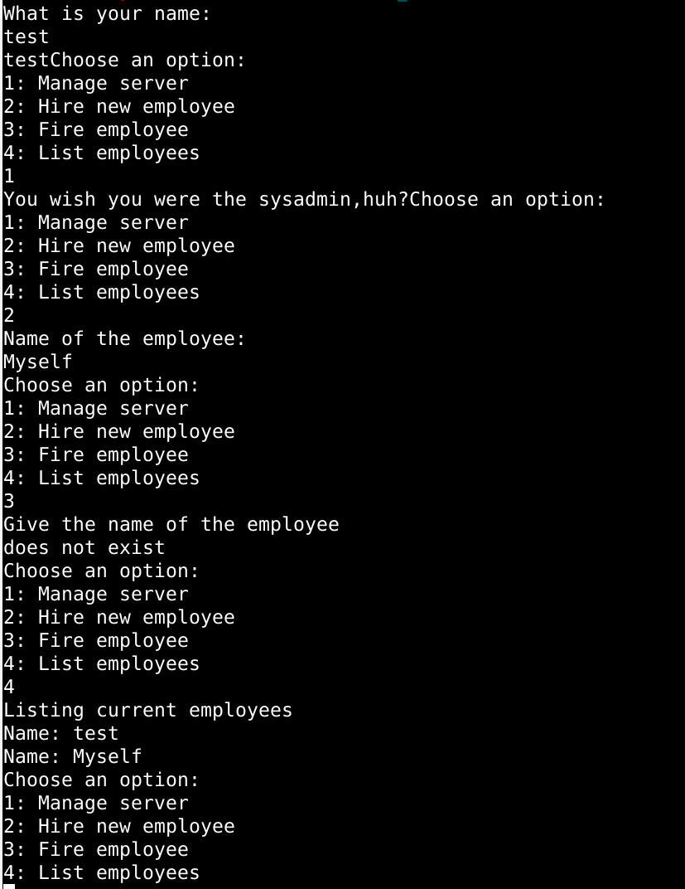
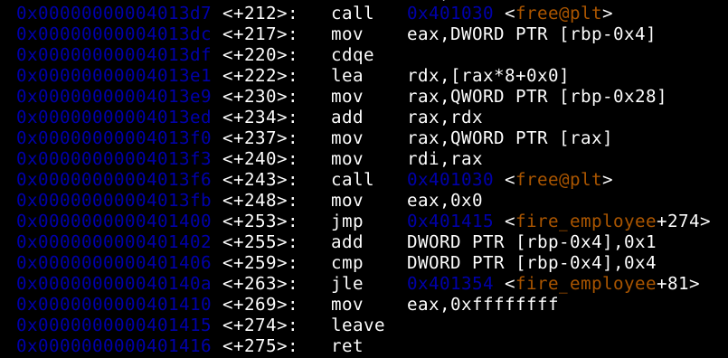
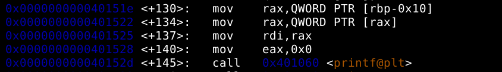
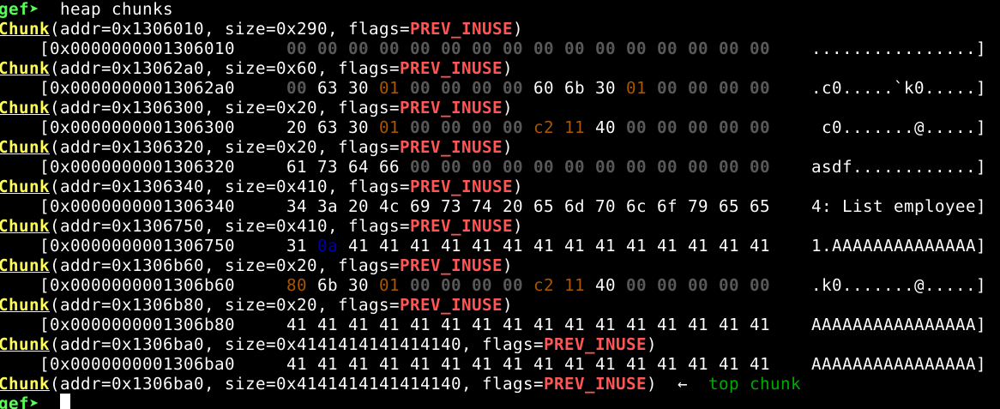
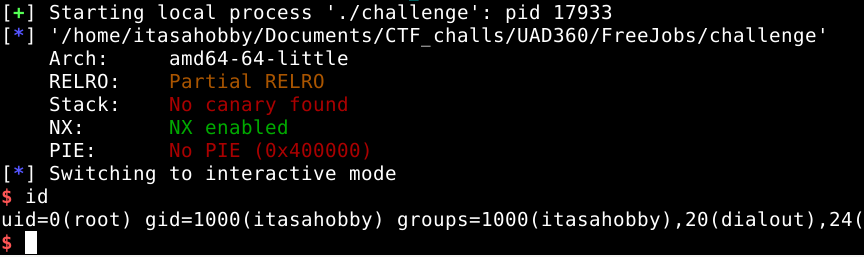

# Free jobs

Build: 
```
gcc -no-pie -o challenge challenge.c
chown root:root challenge
chmod +s challenge
```

## Write-up

There is no source code available so we need to reverse what the binary does. Before anything else let's check what it does, it has a couple functionalities:

* Create a name
* Manage server
* Hire, fire and list employees

Here is a screenshot:



If we have a look at the binary, we can see that `fire_employee` function uses `free` on employees without removing them after from any list:



Also, when we have a look at main, there is a format string vulnerability because it only passes one argument when creating our name at the beginning  of the program:



Another vulnerability available in the binary is a heap overflow, it uses `gets` which doesn't check the amount of data written, here is a screenshot of how the heap chunks look after overwriting garbage:



Once we have all the pieces we know we can exploit an UAF, to do so we need to craft a valid heap chunk leaking the heap address, so we can store a user named `/bin/bash` and overwrite the function called in `list_employees+117` with `manage_server`.

