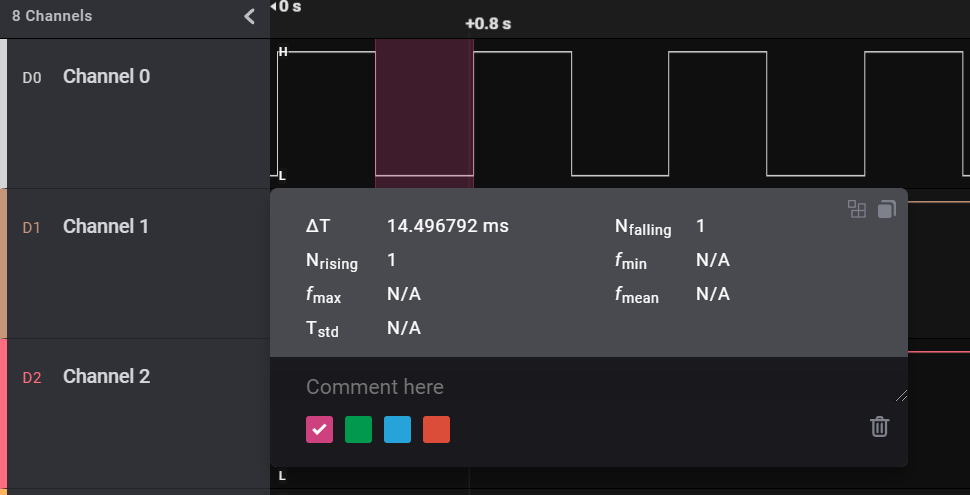
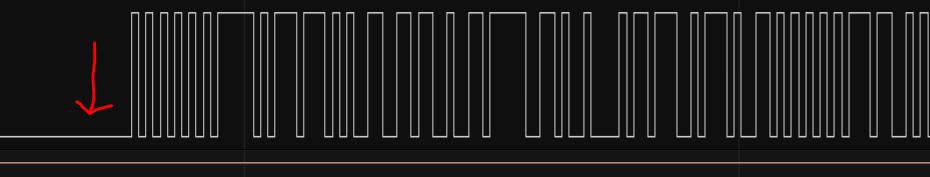
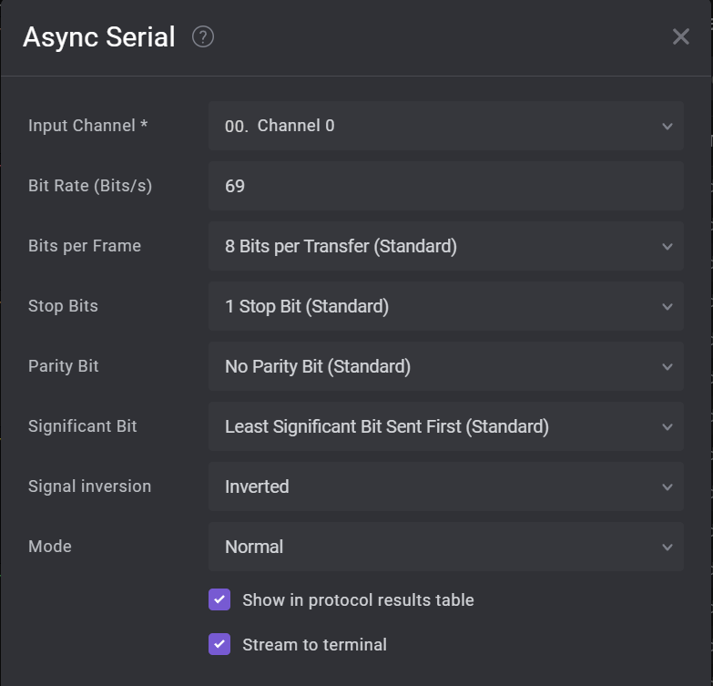
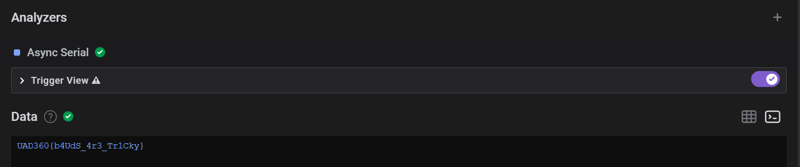

# Underrated

## Summary

Flag: `UAD360{b4UdS_4r3_Tr1Cky}`

Description: I just saw a suspicious guy connecting some wires to an ATM, chased him to ask him what the hell he was doing when he accidentally dropped a USB drive. Could you check it out?

## Write-up

We are provided `UnD3rR4ted.sal` file, looking up the extension we realize that have to be opened with Saleae. 

The captured traffic has a single channel, so it might be UART including one of the channels (RX or TX).

Trying out the most common baud rates does not seem to work, so let's calculate it. In the following, we can see the length of the shortest pulse (14.5ms).



Knowing that getting the baud rate is straight forward, its the inverse:
```
1 / (14.5*1000s) = 69 bauds
```

Still there is something else to figure out, even with the correct baud rate it does not seem to display anything readable. That's because the signal is inverted, regularly UART idle is high, so we know this is the case of an inverted signal because it is idle low. 



Here is the analyzer settings:



Finally, we can just grab the flag:

